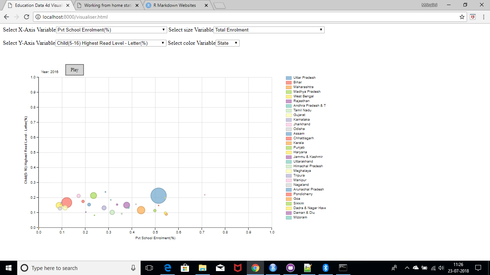

```{r include=FALSE}
rmarkdown::render("C:\\work\\personal_site\\research\\cluster_edu_karnataka\\outcome_report.Rmd", "html_document")

rmarkdown::render("C:\\work\\personal_site\\research\\education_data_4d_visualiser\\4d_visualiser.Rmd", "html_document")

rmarkdown::render("C:\\work\\personal_site\\research\\climate_trend_4d_visualiser\\4d_visualiser.Rmd", "html_document")

```
<style>

#divImgWrapper {
display: inline;
width: 1200px;
display: block;
margin: 0px;
padding: 0px;
position: relative;
top: 50px;
height: auto;
max-width: auto;
overflow-y: hidden;
overflow-x:auto;
}
.divImage
{
display: inline;
margin: 0px;
padding: 20px;
width: 300px;
height: 200px;
}

.divText
{
display: inline;
margin-left: 10px;
padding: 20px;
color: black;
width: 300px;
font-size: medium;
}

p{
width:300px;
color: black;
font-size: medium;
padding-left: 20px;
}
</style>

<html>
<body>
<div id="divImgWrapper">
<table>
<tr>
<td>
<a href="research/cluster_edu_karnataka/outcome_report.html">
<div class = "divImage" id = "divImage_1"> 
 
</div>
<div class = "divText" id = "divText_1"> 
 Cluster Analysis Of Education Data in Karnataka
</div>
</a>
</td>
<td width=50></td>
<td>
<a href="research/education_data_4d_visualiser/4d_visualiser.html">
<div class = "divImage" id = "divImage_2"> 
 
</div>
<div class = "divText" id = "divText_2"> 
 4d Visualisation of Education Data in India
</div>
</a>
</td>
<td width=50></td>
<td>
<a href="research/climate_trend_4d_visualiser/4d_visualiser.html">
<div class = "divImage" id = "divImage_3"> 
 
</div>
<div class = "divText" id = "divText_3"> 
 4d Visualisation of Climate Trend in India
</div>
</a>
</td>

</tr>
</table>
</div>

</body>
</html>
